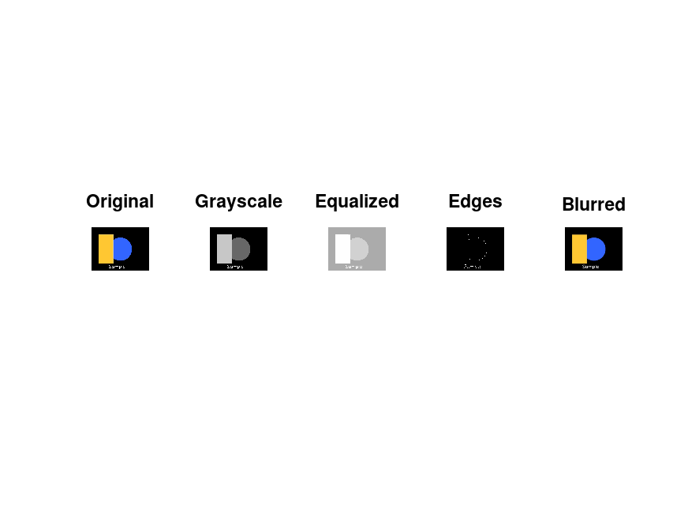
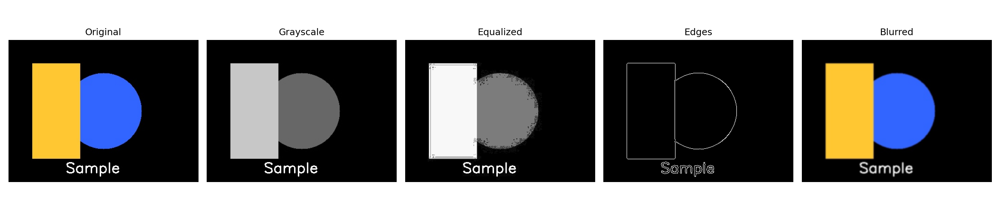

# Laboratory Work: Introduction to Image Recognition Systems

## Purpose

The purpose of the introduction to image recognition systems laboratory work is to get acquainted with MATLAB and Google Colab (Python) software.

The work covers fundamental image processing operations: color space conversion, contrast enhancement, edge detection, and spatial filtering — implemented in both MATLAB (via GNU Octave) and Python (OpenCV + Matplotlib).

---

## Part 1 — MATLAB (GNU Octave)

**Script:** `part1_matlab.m`  
**Output:** `output/result_matlab.png`

### Steps

**Step 1 — Load and display the image**

```matlab
img = imread(img_path);
```

The image is loaded from disk into a 3-channel (RGB) matrix using `imread()`. Each pixel is represented by three integer values (0–255) for red, green, and blue channels.

**Step 2 — Convert RGB to grayscale**

```matlab
gray = rgb2gray(img);
```

`rgb2gray()` collapses the three color channels into a single luminance channel using a weighted sum: `0.299·R + 0.587·G + 0.114·B`. Green is weighted most heavily because the human eye is most sensitive to it.

**Step 3 — Histogram equalization**

```matlab
equalized = histeq(gray);
```

`histeq()` redistributes pixel intensity values so they span the full 0–255 range more evenly. This increases the global contrast of the image, making dark regions brighter and revealing detail that was previously hard to distinguish.

**Step 4 — Edge detection**

```matlab
edges = edge(gray, 'canny');
```

The Canny algorithm detects edges by finding locations of rapid intensity change. It applies Gaussian smoothing first, then computes the gradient magnitude and direction, and uses hysteresis thresholding to produce clean, thin edge lines.

**Step 5 — Gaussian filter (smoothing)**

```matlab
h = fspecial('gaussian', [5 5], 1);
blurred = imfilter(img, h);
```

A 5×5 Gaussian kernel is convolved with the image. The kernel assigns higher weights to pixels near the center, which smooths out noise while preserving overall structure better than a simple box filter.

**Step 6 — Display all variations in one window**

```matlab
subplot(1, 5, 1); imshow(img);       title('Original');
subplot(1, 5, 2); imshow(gray);      title('Grayscale');
...
saveas(gcf, out_path);
```

`subplot()` divides the figure into a 1×5 grid and places each image variation in its own cell. The result is saved to `output/result_matlab.png`.

### Result



---

## Part 2 — Python (OpenCV + Matplotlib)

**Script:** `main.py`  
**Output:** `output/result.png`

> Run locally with the project virtual environment:
> ```bash
> venv/bin/python image-processing-lab/main.py
> ```

### Steps

**Step 1 — Load the image**

```python
img = cv2.imread(img_path)
```

OpenCV loads images in BGR (Blue-Green-Red) channel order by default. The result is a NumPy array of shape `(height, width, 3)`.

**Step 2 — Convert BGR to grayscale**

```python
gray = cv2.cvtColor(img, cv2.COLOR_BGR2GRAY)
```

`cv2.cvtColor()` converts the BGR image to a single-channel grayscale image using the same luminance formula as MATLAB's `rgb2gray()`.

**Step 3 — Histogram equalization**

```python
equalized = cv2.equalizeHist(gray)
```

`cv2.equalizeHist()` performs the same contrast stretching as `histeq()` in MATLAB — it transforms the intensity histogram to be approximately uniform, enhancing visibility in low-contrast regions.

**Step 4 — Edge detection**

```python
edges = cv2.Canny(gray, 100, 200)
```

`cv2.Canny()` applies the Canny edge detector with a lower threshold of 100 and upper threshold of 200. Pixels with gradient above 200 are classified as definite edges; pixels between 100–200 are included only if connected to a definite edge.

**Step 5 — Gaussian filter (smoothing)**

```python
blurred = cv2.GaussianBlur(img, (5, 5), 0)
```

A 5×5 Gaussian kernel is applied to the color image. Setting sigma to 0 lets OpenCV calculate it automatically from the kernel size. The result is a softened version of the original with reduced high-frequency noise.

**Step 6 — Display all variations in one window**

```python
fig, axes = plt.subplots(1, 5, figsize=(18, 4))
...
plt.savefig(out_path, dpi=150)
```

Matplotlib's `subplots()` creates a 1×5 grid of axes. Grayscale images are rendered with `cmap="gray"`. The figure is saved to `output/result.png` at 150 DPI without opening a GUI window (Agg backend).

### Result



---

## Summary

| Operation | MATLAB function | OpenCV function |
|---|---|---|
| Load image | `imread()` | `cv2.imread()` |
| RGB → Grayscale | `rgb2gray()` | `cv2.cvtColor(..., COLOR_BGR2GRAY)` |
| Histogram equalization | `histeq()` | `cv2.equalizeHist()` |
| Edge detection | `edge(..., 'canny')` | `cv2.Canny()` |
| Gaussian smoothing | `fspecial()` + `imfilter()` | `cv2.GaussianBlur()` |
| Display multiple images | `subplot()` | `plt.subplots()` |

Both environments produce equivalent results. MATLAB/Octave offers concise built-in toolbox functions; Python/OpenCV provides more explicit control over parameters and integrates naturally with the NumPy/Matplotlib ecosystem.
