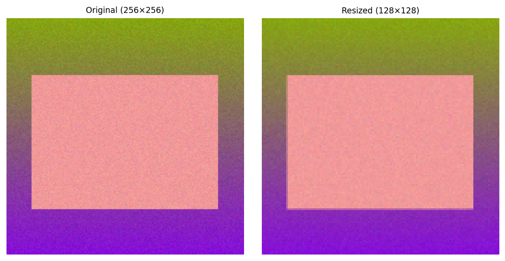
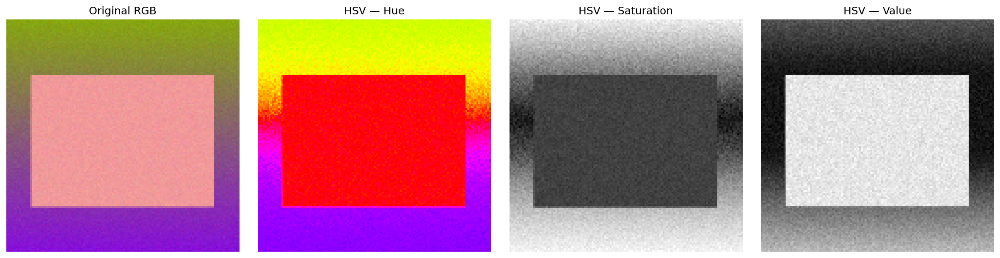
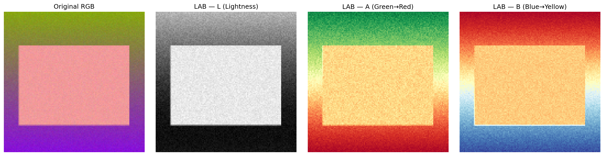
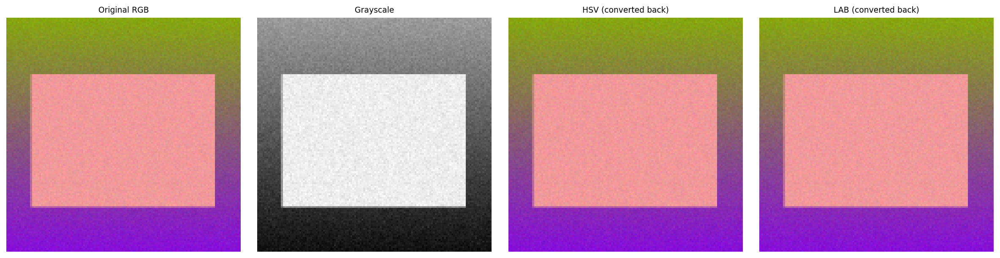
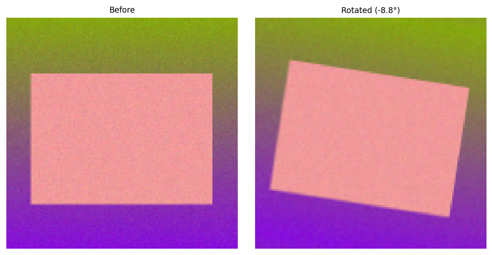
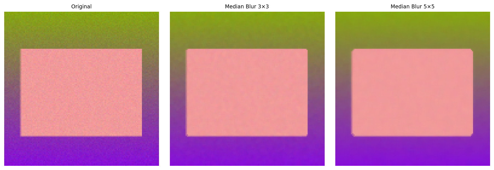
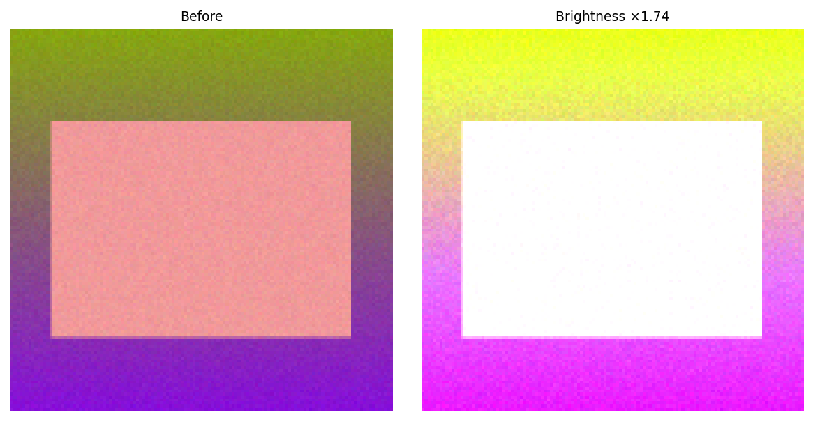
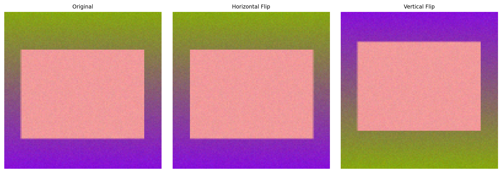
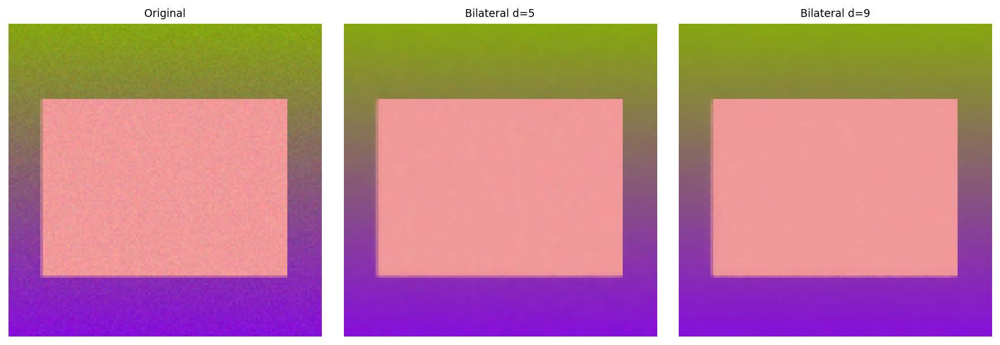
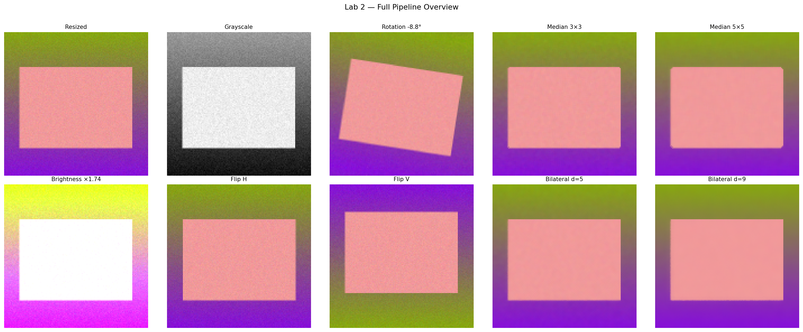

# Lab 2 — Image Color Models, Preprocessing, and Augmentation

## Description

The goal is to provide a solid foundation in image color models, preprocessing techniques, and data augmentation methods essential for image analysis tasks. Understanding various color models such as RGB, HSV, etc., is crucial for effectively processing and analyzing images. By performing preprocessing steps like resizing, normalization, and noise reduction, students will learn to enhance image quality and prepare datasets for machine learning models. Incorporating data augmentation techniques will enable students to create diverse datasets.

## Objective

To develop practical skills in implementing image preprocessing techniques, understanding image color models, and applying data augmentation to improve image analysis results.

## Dataset

A synthetic dataset of 5 images (256×256) was generated programmatically using OpenCV — each image contains random geometric shapes (circle + rectangle) on a color gradient background with added noise. This simulates a real Kaggle dataset for all subsequent operations.

---

## Step 1 — Resize Images

**Goal:** Standardize all images to 128×128 pixels so that every sample has the same spatial dimensions before feeding into a model.

```python
resized = cv2.resize(img, (128, 128), interpolation=cv2.INTER_LINEAR)
```

`cv2.INTER_LINEAR` (bilinear interpolation) averages neighboring pixels when downscaling — it preserves more detail than nearest-neighbor while being faster than bicubic.

**Intermediate outputs:**

| File | Description |
|---|---|
| `step1_original_256x256.png` | Source image before resizing |
| `step1_resized_128x128.png` | Image after resize to 128×128 |
| `step1_resized_sample2.png` | Second dataset sample resized |
| `step1_resized_sample3.png` | Third dataset sample resized |

**Comparison:**



---

## Step 2 — Color Space Conversions

**Goal:** Represent the same image in different color models to understand what information each channel encodes and how it can be used in analysis.

### 2a — Grayscale

```python
gray = cv2.cvtColor(resized, cv2.COLOR_BGR2GRAY)
```

Collapses three channels into one using the luminance formula `0.299·R + 0.587·G + 0.114·B`. Reduces data volume and removes color information irrelevant to shape-based tasks.


### 2b — HSV (Hue, Saturation, Value)

```python
hsv = cv2.cvtColor(resized, cv2.COLOR_BGR2HSV)
```

Separates chromatic information (Hue) from intensity (Value). Useful for color-based segmentation because Hue is stable under lighting changes, while Value captures brightness independently.

- **Hue** — color type (0–179 in OpenCV, represents 0°–360°)
- **Saturation** — color purity (0 = gray, 255 = fully saturated)
- **Value** — brightness (0 = black, 255 = full brightness)



### 2c — LAB (Lightness, A, B)

```python
lab = cv2.cvtColor(resized, cv2.COLOR_BGR2LAB)
```

Designed to be perceptually uniform — equal numerical differences correspond to equal perceived color differences. Separates lightness (L) completely from color (A = green↔red axis, B = blue↔yellow axis).

- **L** — Lightness (0–100)
- **A** — Green to Red opponent channel
- **B** — Blue to Yellow opponent channel



**Overview — all three color models:**



---

## Step 3 — Data Augmentation

**Goal:** Artificially expand the dataset by applying random transformations and filters. This reduces overfitting in ML models by exposing them to more variation.

### 3a — Random Rotation

```python
angle = random.uniform(-45, 45)
M = cv2.getRotationMatrix2D((64, 64), angle, 1.0)
rotated = cv2.warpAffine(resized, M, (128, 128), borderMode=cv2.BORDER_REFLECT)
```

Rotates the image by a random angle in the range –45° to +45°. `BORDER_REFLECT` fills the empty corners by mirroring the edge pixels, avoiding black artifacts.



---

### 3b — Median Blur

```python
median_3 = cv2.medianBlur(resized, 3)   # 3×3 kernel
median_5 = cv2.medianBlur(resized, 5)   # 5×5 kernel
```

Replaces each pixel with the median value of its neighborhood. Highly effective against salt-and-pepper noise because the median is resistant to outliers. Larger kernel = stronger smoothing but more detail loss.

| Kernel | Effect |
|---|---|
| 3×3 | Light smoothing, fine noise removed |
| 5×5 | Stronger smoothing, coarser noise removed |



---

### 3c — Random Brightness Adjustment

```python
factor = random.uniform(0.5, 1.8)
bright = cv2.convertScaleAbs(resized, alpha=factor, beta=0)
```

Multiplies every pixel value by `alpha`. Values below 1.0 darken the image; above 1.0 brighten it. Simulates different lighting conditions in the training set.



---

### 3d — Horizontal and Vertical Flips

```python
flip_h = cv2.flip(resized, 1)   # horizontal
flip_v = cv2.flip(resized, 0)   # vertical
```

Mirrors the image along the vertical axis (horizontal flip) or horizontal axis (vertical flip). A zero-cost augmentation that doubles the effective dataset size for any task where orientation symmetry holds.



---

### 3e — Bilateral Filter

```python
bilateral_5 = cv2.bilateralFilter(resized, d=5, sigmaColor=75, sigmaSpace=75)
bilateral_9 = cv2.bilateralFilter(resized, d=9, sigmaColor=75, sigmaSpace=75)
```

Unlike Gaussian blur, the bilateral filter weights neighbors by both spatial distance (`sigmaSpace`) and color similarity (`sigmaColor`). This preserves sharp edges while smoothing uniform regions — important when edge information must be retained after noise reduction.

| Parameter | d=5 | d=9 |
|---|---|---|
| Neighborhood | 5×5 | 9×9 |
| Smoothing strength | Mild | Strong |
| Edge preservation | High | High |



---

## Full Pipeline Overview

All processing steps side by side on the same source image:



---

## Output Files

| File | Step | Description |
|---|---|---|
| `step1_original_256x256.png` | 1 | Source image (256×256) |
| `step1_resized_128x128.png` | 1 | After resize (128×128) |
| `step1_resized_sample2.png` | 1 | Dataset sample 2 resized |
| `step1_resized_sample3.png` | 1 | Dataset sample 3 resized |
| `step1_resize_comparison.png` | 1 | Before/after comparison |
| `step2_grayscale.png` | 2 | Grayscale conversion |
| `step2_hsv_raw.png` | 2 | HSV raw output |
| `step2_hsv_channels.png` | 2 | HSV H/S/V channels |
| `step2_lab_raw.png` | 2 | LAB raw output |
| `step2_lab_channels.png` | 2 | LAB L/A/B channels |
| `step2_color_models_overview.png` | 2 | All color models side by side |
| `step3a_rotation.png` | 3a | Rotated image |
| `step3a_rotation_comparison.png` | 3a | Rotation before/after |
| `step3b_median_blur_3x3.png` | 3b | Median blur 3×3 |
| `step3b_median_blur_5x5.png` | 3b | Median blur 5×5 |
| `step3b_median_blur_comparison.png` | 3b | Median blur comparison |
| `step3c_brightness.png` | 3c | Brightness adjusted |
| `step3c_brightness_comparison.png` | 3c | Brightness before/after |
| `step3d_flip_horizontal.png` | 3d | Horizontal flip |
| `step3d_flip_vertical.png` | 3d | Vertical flip |
| `step3d_flips_comparison.png` | 3d | Flips comparison |
| `step3e_bilateral_d5.png` | 3e | Bilateral filter d=5 |
| `step3e_bilateral_d9.png` | 3e | Bilateral filter d=9 |
| `step3e_bilateral_comparison.png` | 3e | Bilateral comparison |
| `overview_full_pipeline.png` | — | Full pipeline grid |

## Summary

| Operation | OpenCV function | Purpose |
|---|---|---|
| Resize | `cv2.resize()` | Standardize input dimensions |
| Grayscale | `cv2.cvtColor(BGR2GRAY)` | Remove color, reduce channels |
| HSV | `cv2.cvtColor(BGR2HSV)` | Separate hue from brightness |
| LAB | `cv2.cvtColor(BGR2LAB)` | Perceptually uniform color space |
| Rotation | `cv2.warpAffine()` | Orientation invariance |
| Median Blur | `cv2.medianBlur()` | Salt-and-pepper noise removal |
| Brightness | `cv2.convertScaleAbs()` | Lighting variation simulation |
| Flip | `cv2.flip()` | Mirror augmentation |
| Bilateral | `cv2.bilateralFilter()` | Edge-preserving smoothing |
