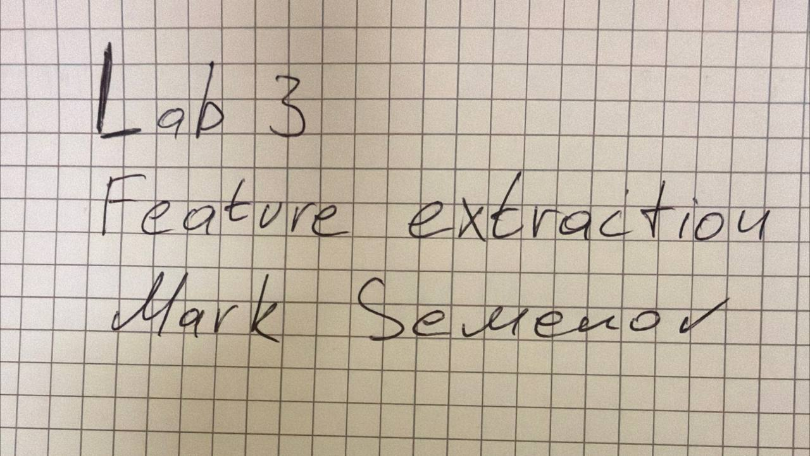
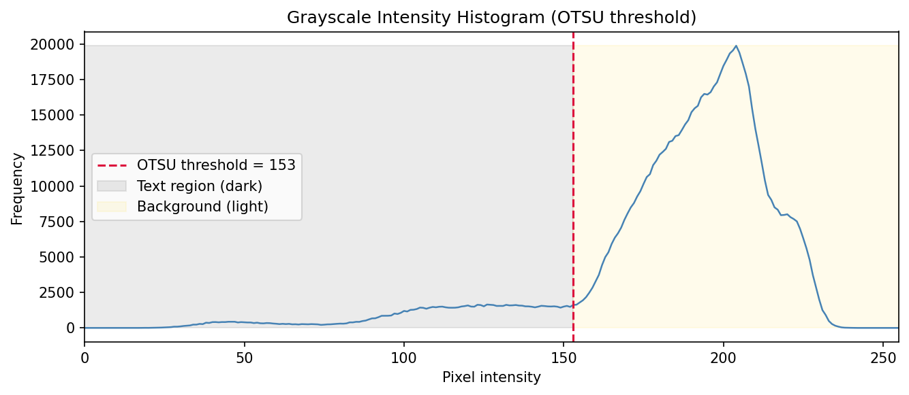
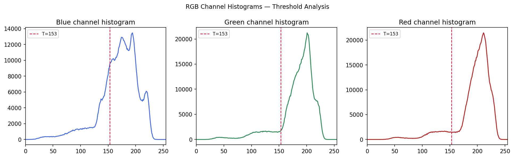
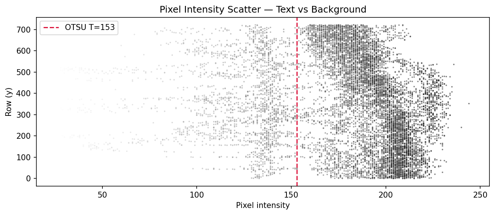
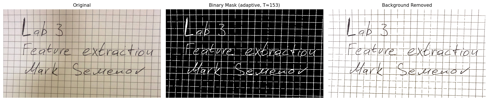
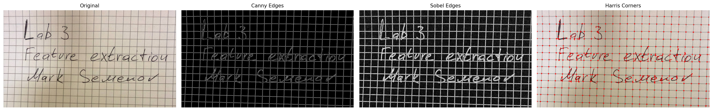
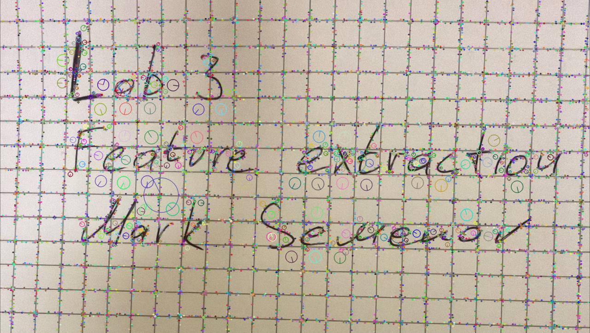
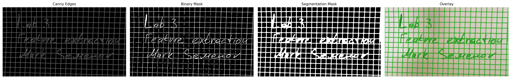
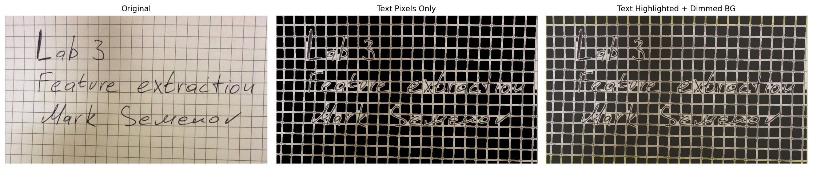
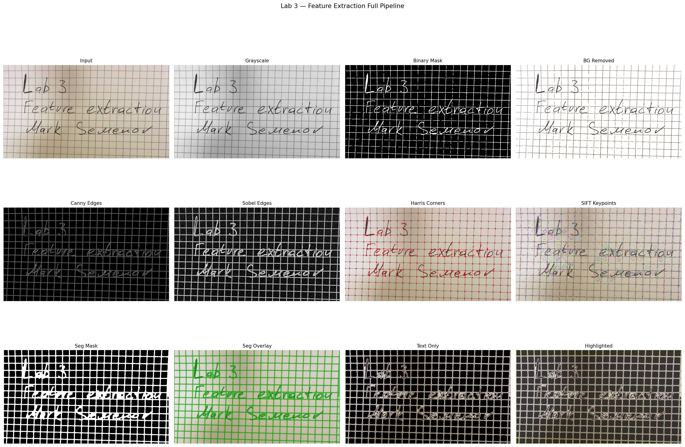

# Lab 3 — Feature Extraction and Application in Images

## Description

Feature extraction is one of the essential stages in image processing, where the goal is to reduce the complexity and dimensionality of the image. The feature extraction process involves selecting relevant features that distinguish the image, such as edges, corners, textures, shapes, colors, and patterns.

## Objective

To implement various feature extraction methods and explore image segmentation, where the image is divided into meaningful semantic regions based on chosen criteria.

## Input Image

A photograph of handwritten text ("Lab 3 / Feature extraction / Mark Semenov") on grid paper — high-contrast dark ink on a light background.



---

## Step 1 — Color Spectrogram Analysis

**Goal:** Analyze the pixel intensity distribution across color channels to determine threshold values that separate text pixels from the background.

The grayscale histogram shows a clear bimodal distribution — a large peak near 200–230 (background) and a smaller cluster below 153 (ink). The OTSU algorithm automatically finds the optimal threshold between these two groups by minimizing intra-class variance.

**OTSU threshold: 153** — pixels below this value are classified as text, above as background.

```python
otsu_thresh, _ = cv2.threshold(gray, 0, 255, cv2.THRESH_BINARY + cv2.THRESH_OTSU)
```



The RGB channel histograms confirm the same pattern across all three channels — the ink registers consistently dark in R, G, and B.



The intensity scatter plot maps each sampled pixel's intensity against its row position, visually confirming the two populations (dark ink strokes vs. light paper).



---

## Step 2 — Background Removal

**Goal:** Use the threshold analysis to isolate text pixels and remove the paper/grid background.

Global OTSU thresholding alone struggles with the non-uniform lighting and grid lines of the photo. Adaptive thresholding computes a local threshold for each pixel neighborhood, making it robust to illumination gradients:

```python
adaptive = cv2.adaptiveThreshold(
    gray, 255,
    cv2.ADAPTIVE_THRESH_GAUSSIAN_C,
    cv2.THRESH_BINARY_INV,
    blockSize=31, C=10
)
```

Morphological opening removes small noise speckles; closing fills gaps within letter strokes.



---

## Step 3 — Edge Detection

**Goal:** Apply multiple edge and feature detection algorithms to isolate structural boundaries of the handwritten text.

### Canny

```python
canny = cv2.Canny(blurred, 30, 100)
```

Two-stage hysteresis thresholding (30 / 100) produces thin, clean edges along letter contours. The lower threshold captures weak continuation edges; the upper ensures only strong gradients start a new edge chain.

### Sobel

```python
sobelx = cv2.Sobel(gray, cv2.CV_64F, 1, 0, ksize=3)
sobely = cv2.Sobel(gray, cv2.CV_64F, 0, 1, ksize=3)
sobel  = np.sqrt(sobelx**2 + sobely**2)
```

Computes gradient magnitude in both axes and combines them. Shows thicker edges than Canny and is sensitive to both horizontal and vertical strokes.

### Harris Corners

```python
harris = cv2.cornerHarris(np.float32(gray), blockSize=2, ksize=3, k=0.04)
```

Detects locations where intensity changes sharply in multiple directions — letter junctions, endpoints, and curves. Marked in red on the original image.

### SIFT Keypoints

```python
sift = cv2.SIFT_create()
kp, _ = sift.detectAndCompute(gray, None)
```

Scale-Invariant Feature Transform detected **9512 keypoints**. Each keypoint carries a scale and orientation descriptor — useful for matching or recognizing text regions across transformed images.





---

## Step 4 — Image Segmentation

**Goal:** Combine the edge map and binary mask into a unified segmentation mask that cleanly separates text regions from background.

```python
edge_dilated = cv2.dilate(canny, np.ones((3, 3), np.uint8), iterations=2)
seg_mask = cv2.bitwise_or(binary_clean, edge_dilated)
seg_mask = cv2.morphologyEx(seg_mask, cv2.MORPH_CLOSE, kernel, iterations=2)
```

Canny edges are dilated to close small gaps, then merged with the adaptive binary mask via OR. A final morphological closing operation connects nearby fragments into solid text regions.



---

## Step 5 — Segmentation Mask Application

**Goal:** Apply the segmentation mask to produce two distinct image variations demonstrating the practical use of the extracted text regions.

**Variation A — Text pixels only (black background):**
All pixels outside the mask are set to zero, leaving only the raw ink strokes.

```python
text_only = np.where(mask3_seg > 0, img_bgr, np.zeros_like(img_bgr))
```

**Variation B — Text highlighted, background dimmed:**
Text region retains full color; background is reduced to 25% brightness. Contour outlines are drawn in cyan to emphasize segmentation boundaries.

```python
dimmed = (img_bgr * 0.25).astype(np.uint8)
highlighted = np.where(mask3_seg > 0, img_bgr, dimmed)
cv2.drawContours(highlighted, contours, -1, (0, 220, 200), 1)
```



---

## Full Pipeline Overview



---

## Output Files

| File | Description |
|---|---|
| `input_handwritten.png` | Original photo (copied to output for reference) |
| `input_grayscale.png` | Grayscale conversion of input |
| `step1_grayscale_histogram.png` | Intensity histogram with OTSU threshold marked |
| `step1_rgb_histograms.png` | R/G/B channel histograms |
| `step1_intensity_scatter.png` | Pixel intensity scatter by row |
| `step2_binary_mask.png` | Adaptive threshold binary mask |
| `step2_background_removed.png` | Text on white background |
| `step2_background_removed_alpha.png` | Text with transparent background (BGRA) |
| `step2_background_removal_comparison.png` | Step 2 before/after comparison |
| `step3_edges_canny.png` | Canny edge map |
| `step3_edges_sobel.png` | Sobel gradient magnitude |
| `step3_harris_corners.png` | Harris corner detection overlay |
| `step3_sift_keypoints.png` | SIFT keypoints (9512 detected) |
| `step3_edge_detection_comparison.png` | All edge methods side by side |
| `step4_segmentation_mask.png` | Final segmentation mask |
| `step4_segmentation_overlay.png` | Mask overlaid on original |
| `step4_segmentation_comparison.png` | Step 4 comparison grid |
| `step5_text_only.png` | Text pixels on black background |
| `step5_text_highlighted.png` | Text highlighted, background dimmed |
| `step5_mask_application_comparison.png` | Both mask variations side by side |
| `overview_full_pipeline.png` | Full 12-step pipeline grid |

## Summary

| Task | Method | Key function |
|---|---|---|
| Threshold analysis | OTSU | `cv2.threshold(..., THRESH_OTSU)` |
| Background removal | Adaptive threshold + morphology | `cv2.adaptiveThreshold()` |
| Edge detection | Canny | `cv2.Canny()` |
| Edge detection | Sobel | `cv2.Sobel()` |
| Corner detection | Harris | `cv2.cornerHarris()` |
| Keypoint detection | SIFT | `cv2.SIFT_create()` |
| Segmentation mask | Bitwise OR + morphological close | `cv2.bitwise_or()` |
| Mask application | NumPy where | `np.where(mask, fg, bg)` |
