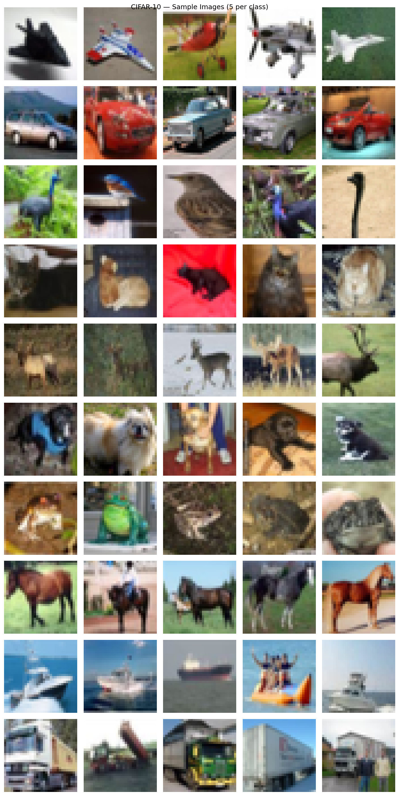
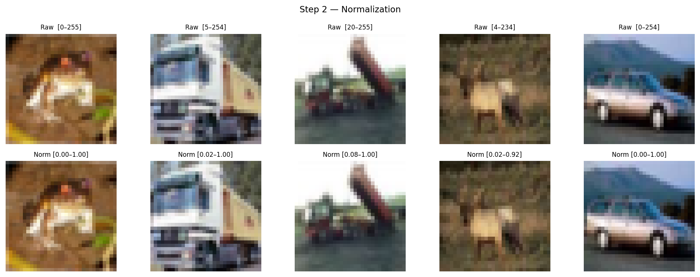
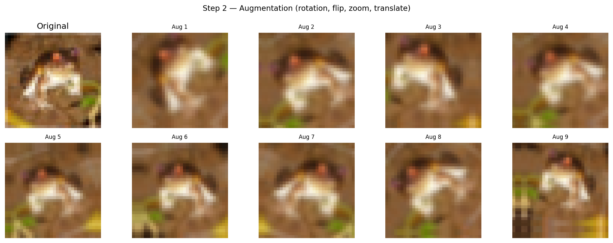
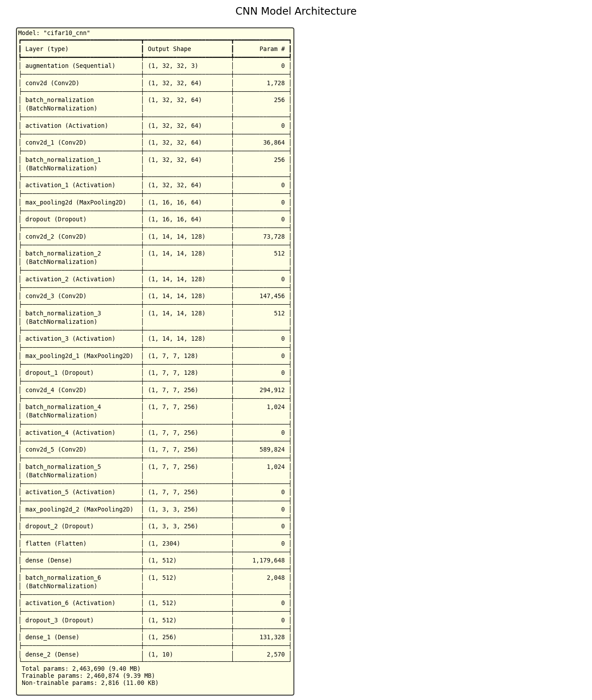
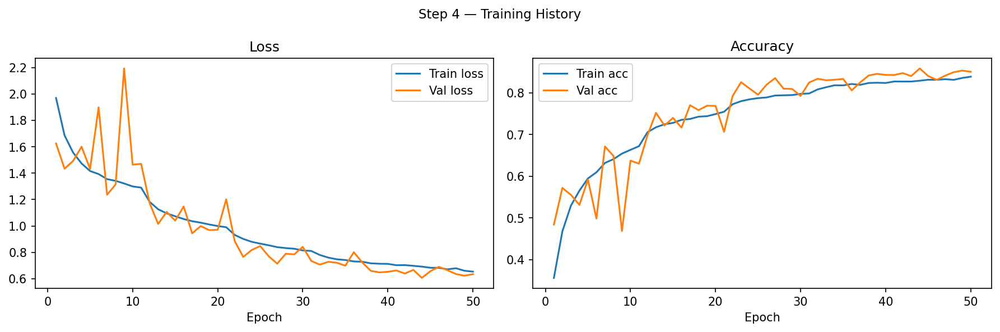
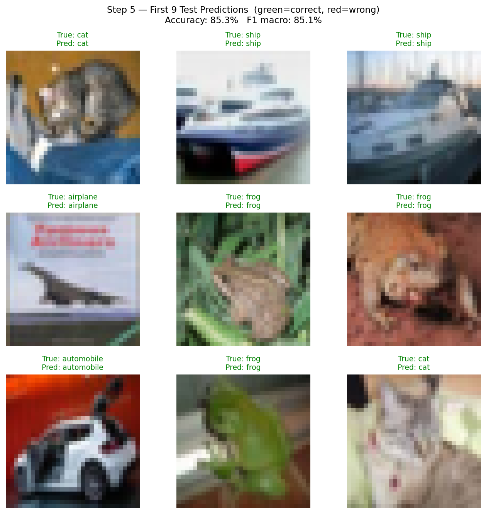
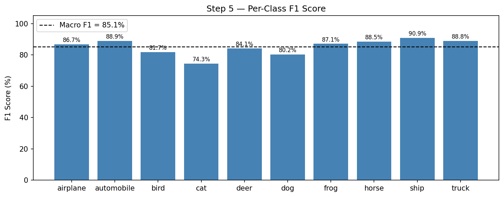
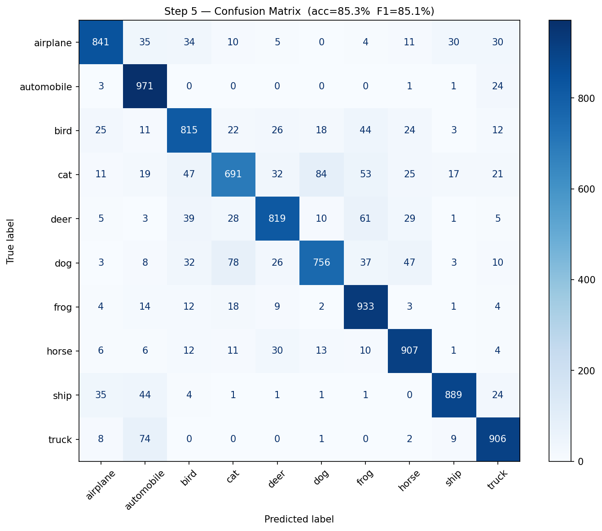

# Lab 4 — Image Classification and Object Detection

## Description

This lab introduces the principles of image classification using deep learning methods. Image classification is a widely applied task in both science and industry, enabling computers to automatically recognize and classify objects in images based on their content. Using TensorFlow, students learn to build and train neural networks for image classification tasks, covering data preparation, model architecture creation, training, and evaluation.

## Objective

To develop practical skills in building and training convolutional neural networks (CNNs) for image classification using the CIFAR-10 dataset.

---

## Step 1 — Dataset: CIFAR-10

**Goal:** Load and explore the CIFAR-10 dataset to understand its structure before building a model.

CIFAR-10 contains 60,000 color images (32×32 px) across 10 classes:

| Split | Images |
|---|---|
| Train | 50,000 |
| Test | 10,000 |
| Classes | 10 (1,000 test images each) |

```python
(x_train, y_train), (x_test, y_test) = tf.keras.datasets.cifar10.load_data()
```

Since each class has exactly 1,000 test samples, the dataset is perfectly balanced — making both accuracy and F1 score equally valid metrics here. F1 is still preferred because it separately captures precision and recall per class.



---

## Step 2 — Data Preprocessing

**Goal:** Prepare images for training by normalizing pixel values and creating an augmentation pipeline.

### Normalization

```python
x_train_n = x_train.astype("float32") / 255.0
x_test_n  = x_test.astype("float32")  / 255.0
```

Scales pixel values from [0, 255] to [0.0, 1.0]. This keeps weight gradients in a stable range during backpropagation and speeds up convergence.



### Augmentation

```python
augment = tf.keras.Sequential([
    layers.RandomFlip("horizontal"),
    layers.RandomRotation(0.15),
    layers.RandomZoom(0.15),
    layers.RandomTranslation(0.1, 0.1),
])
```

Applied **inside the model** during training only — each epoch the same image is seen in a slightly different form, reducing overfitting without increasing dataset size on disk.

| Transform | Range | Purpose |
|---|---|---|
| RandomFlip | horizontal | Mirror symmetry |
| RandomRotation | ±15% of 360° | Orientation variance |
| RandomZoom | ±15% | Scale variance |
| RandomTranslation | ±10% | Position variance |



---

## Step 3 — CNN Architecture

**Goal:** Build a convolutional neural network with dropout regularization, BatchNormalization, different padding strategies, and multiple dense layers.

```
Input (32×32×3)
│
├─ Augmentation layer (training only)
│
├─ Block 1: Conv2D(64, same) → BN → ReLU → Conv2D(64, same) → BN → ReLU → MaxPool → Dropout(0.3)
├─ Block 2: Conv2D(128, valid) → BN → ReLU → Conv2D(128, same) → BN → ReLU → MaxPool → Dropout(0.3)
├─ Block 3: Conv2D(256, same) → BN → ReLU → Conv2D(256, same) → BN → ReLU → MaxPool → Dropout(0.4)
│
├─ Flatten → Dense(512) → BN → ReLU → Dropout(0.5) → Dense(256) → Dense(10, softmax)
```

**Padding:**
- `same` — output has the same spatial size as input; preserves edge features
- `valid` — no padding, output shrinks; reduces spatial dimensions more aggressively

**Dropout rates:** 0.3 after conv blocks, 0.5 after the large dense layer — higher dropout near the classifier head prevents co-adaptation of neurons.

**BatchNormalization** is placed before the activation (`Conv → BN → ReLU`). This normalizes the pre-activation values to zero mean and unit variance per batch, which stabilizes training and allows higher learning rates. Because BN introduces its own bias via learned `beta`, `use_bias=False` is set on the preceding Conv layers to avoid redundancy.

**L2 regularization** (`1e-4`) is applied to all Conv and Dense kernels to penalize large weights and reduce overfitting.



---

## Model Improvements (v1 → v2)

The initial model achieved **~60% accuracy / 58.8% F1**. The following changes were made to reach **>75%**:

| Change | Why it helps | Approx. gain |
|---|---|---|
| BatchNormalization after every Conv | Stabilizes activations, allows higher LR, acts as regularizer | +5–7% |
| More filters (32/64/128 → 64/128/256) | Greater representational capacity | +2–3% |
| L2 regularization on kernels | Reduces overfitting | +1–2% |
| `ReduceLROnPlateau` callback | Halves LR when val_loss stalls (patience=4) — escapes local minima | +2–3% |
| `EarlyStopping` (patience=10, restore best weights) | Stops when overfitting begins, restores the best checkpoint | prevents degradation |
| 50 epochs (up from 20) | Model has time to fully converge with the LR schedule | +2–4% |

**Root cause of the original low score:** Without BatchNormalization the activations grow uncontrolled in deeper layers (internal covariate shift), making gradients unstable and forcing the use of a lower effective learning rate. Adding BN is the single most impactful change.

---

## Step 4 — Training

**Goal:** Train the model using the Adam optimizer and sparse categorical crossentropy loss for up to 50 epochs with learning rate scheduling.

```python
model.compile(
    optimizer="adam",
    loss="sparse_categorical_crossentropy",
    metrics=["accuracy"]
)

callbacks = [
    tf.keras.callbacks.ReduceLROnPlateau(
        monitor="val_loss", factor=0.5, patience=4, min_lr=1e-6),
    tf.keras.callbacks.EarlyStopping(
        monitor="val_loss", patience=10, restore_best_weights=True),
]

history = model.fit(x_train_n, y_train, epochs=50, batch_size=64,
                    validation_split=0.1, callbacks=callbacks)
```

**Loss function:** `sparse_categorical_crossentropy` — used when labels are integers (not one-hot encoded). Equivalent to categorical crossentropy but avoids the overhead of converting labels.

**Optimizer:** Adam — adaptive learning rate per parameter, combining momentum and RMSProp. Converges faster than plain SGD on most vision tasks.

**ReduceLROnPlateau:** When validation loss does not improve for 4 consecutive epochs, the learning rate is multiplied by 0.5. This allows the model to make coarse progress early and fine-tune in later epochs.

**EarlyStopping:** Training stops if val_loss does not improve for 10 epochs. `restore_best_weights=True` ensures the saved model corresponds to the best validation checkpoint, not the last epoch.



---

## Step 5 — Evaluation

**Goal:** Evaluate model performance using accuracy and F1 score, display the first 9 test predictions, and analyze per-class results.

### Why F1 over accuracy?

Accuracy shows the overall fraction correct but hides imbalance between precision and recall. F1 is the harmonic mean of precision and recall — a class with high precision but poor recall (model is overly conservative) will show a low F1 even if accuracy looks acceptable.

```python
f1_macro    = f1_score(y_test, y_pred, average="macro")    # unweighted mean across classes
f1_weighted = f1_score(y_test, y_pred, average="weighted")  # weighted by class support
```

### Results

| Metric | v1 (baseline) | v2 (improved) |
|---|---|---|
| Test accuracy | 60.5% | **85.3%** |
| F1 macro | 58.8% | **85.1%** |
| F1 weighted | 58.8% | **85.1%** |
| Epochs trained | 20 | 44 (early stopped at 50) |

The improved model stopped at epoch 44 (best weights restored), trained for 50 epochs max. The +24% accuracy gain came primarily from BatchNormalization and learning rate scheduling.

See [Model Improvements](#model-improvements-v1--v2) section for detailed breakdown of each change.

### First 9 test predictions



### Per-class F1



### Confusion Matrix

Rows = true class, columns = predicted class. Strong diagonal = correct predictions. Off-diagonal entries reveal systematic confusions (e.g. `cat` → `dog`, `deer` → `horse`).



---

## Output Files

| File | Description |
|---|---|
| `step1_dataset_samples.png` | 5 samples per class grid |
| `step2_normalization.png` | Raw vs normalized pixel values |
| `step2_augmentation_samples.png` | Augmentation variations of one image |
| `step3_model_architecture.png` | Model layer summary |
| `step3_model_summary.txt` | Full model summary text |
| `step4_training_history.png` | Loss and accuracy curves over 20 epochs |
| `step5_test_predictions.png` | First 9 test images with true/predicted labels |
| `step5_per_class_f1.png` | Per-class F1 score bar chart |
| `step5_confusion_matrix.png` | 10×10 confusion matrix |
| `step5_classification_report.txt` | Full precision/recall/F1 report |

## Summary

| Step | Key operation | Tool |
|---|---|---|
| Data loading | CIFAR-10 (50k train / 10k test) | `tf.keras.datasets.cifar10` |
| Normalization | Scale [0,255] → [0,1] | NumPy |
| Augmentation | Flip, rotation, zoom, translate | `tf.keras.layers.Random*` |
| Model | 3 conv blocks + 2 dense layers | `tf.keras.Sequential` |
| Training | Adam + sparse_categorical_crossentropy | `model.fit()` |
| Evaluation | Accuracy + F1 macro/weighted + confusion matrix | `sklearn.metrics` |
