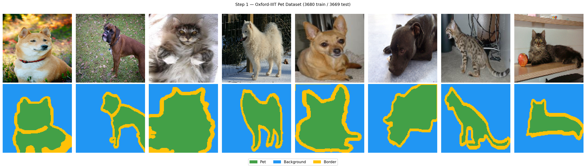
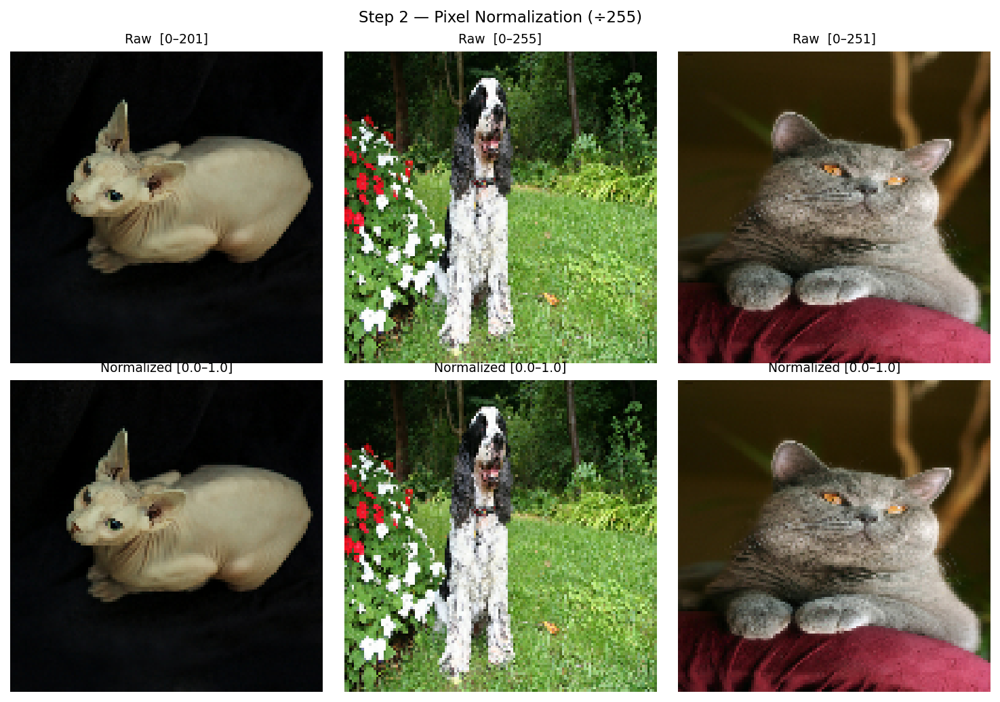
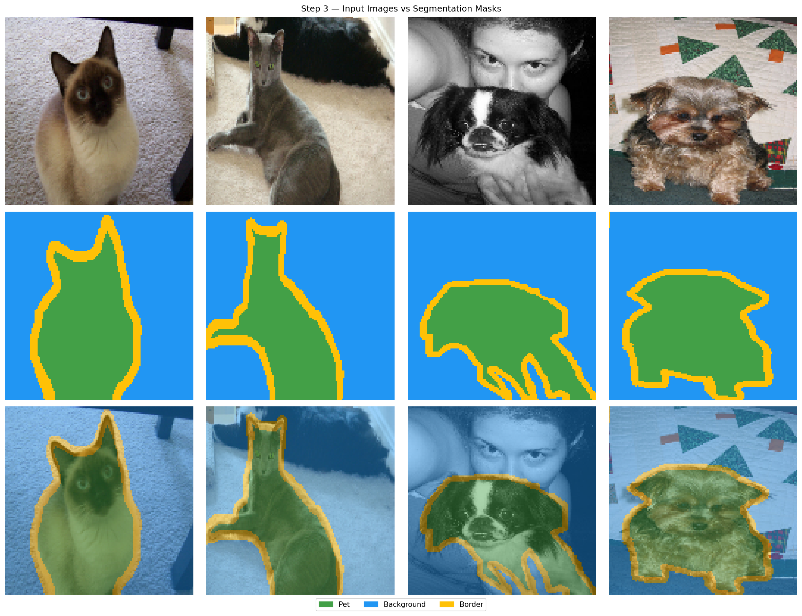
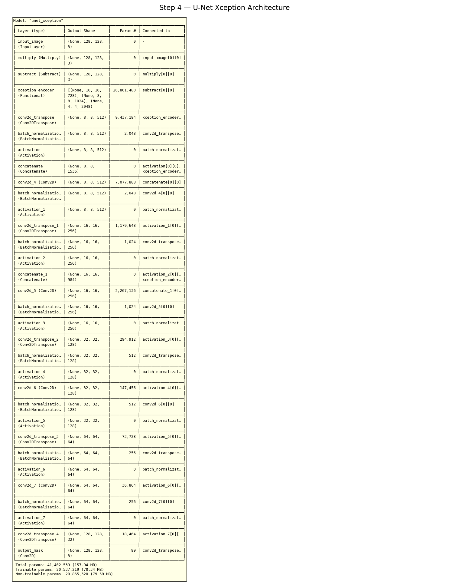
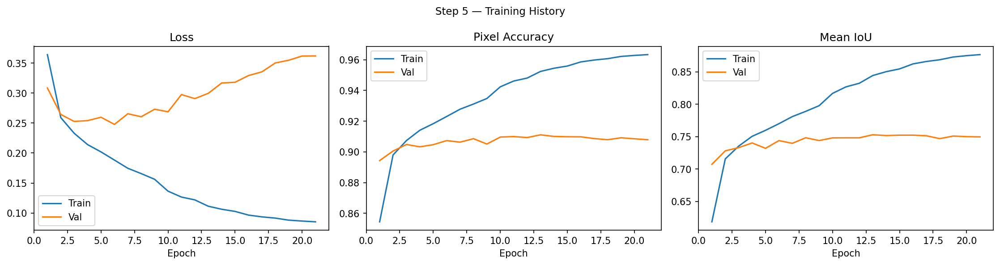
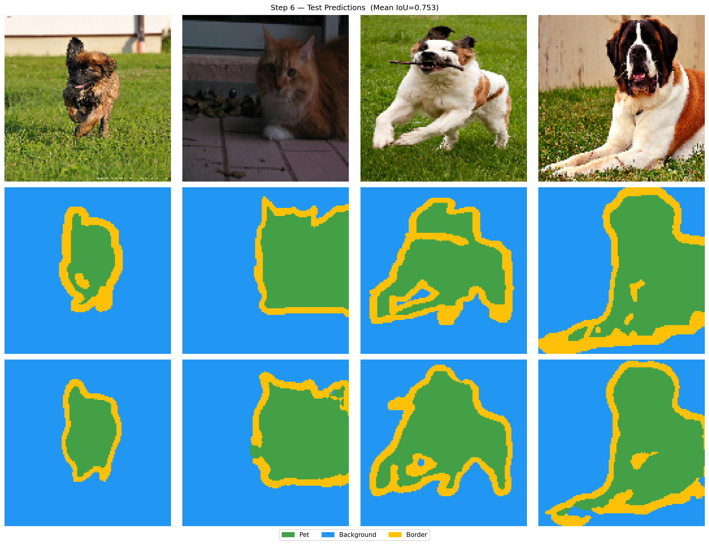
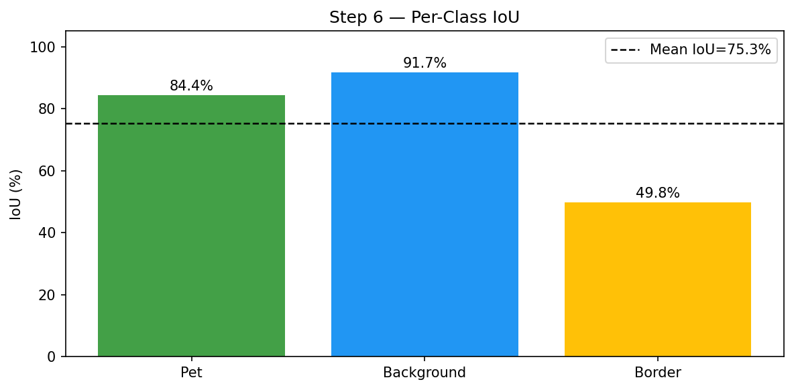

# Lab 5 — Advanced Image Segmentation Methods

## Description

This lab focuses on advanced image segmentation techniques, particularly semantic segmentation using convolutional neural networks. Semantic segmentation assigns a class label to each pixel in an image, allowing precise object identification.

## Objective

To implement a full semantic segmentation pipeline: dataset preparation, U-Net model with a pretrained Xception encoder, training with IoU monitoring, and qualitative/quantitative evaluation on test data.

---

## Dataset — Oxford-IIIT Pet

A publicly available dataset of 37 pet categories with pixel-wise segmentation masks (trimap).

| Split | Images |
|---|---|
| Train | 3,680 |
| Test | 3,669 |
| Classes | 3 (pet, background, border) |

The masks use values 1/2/3 which are shifted to 0/1/2 during preprocessing:

| Class | Value | Color |
|---|---|---|
| Pet (foreground) | 0 | Green |
| Background | 1 | Blue |
| Border / uncertain | 2 | Yellow |

---

## Step 1 — Load and Explore the Dataset

**Goal:** Load the Oxford-IIIT Pet dataset via TensorFlow Datasets and visualize image–mask pairs to understand the segmentation task.

```python
dataset, info = tfds.load("oxford_iiit_pet", with_info=True)
```

Each sample contains a variable-resolution RGB photo of a pet and a corresponding trimap mask. The border class (yellow) marks pixels where the boundary between pet and background is ambiguous.



---

## Step 2 — Preprocessing and Normalization

**Goal:** Resize all images to a fixed 128×128 resolution and normalize pixel values to [0.0, 1.0].

```python
def preprocess(sample):
    image = tf.image.resize(..., [128, 128]) / 255.0
    mask  = tf.image.resize(..., method="nearest")   # nearest to preserve class labels
    mask  = tf.cast(mask, tf.int32) - 1              # [1,2,3] → [0,1,2]
    mask  = tf.squeeze(mask, axis=-1)
    return image, mask
```

Masks are resized with `nearest` interpolation — bilinear or bicubic would interpolate between class indices producing meaningless fractional values.

The dataset pipeline uses `.cache().shuffle().batch().prefetch()` for efficient GPU utilization during training.



---

## Step 3 — Visualize Images Alongside Segmentation Masks

**Goal:** Inspect aligned image–mask pairs and overlays before training to confirm preprocessing is correct.

Three rows are displayed per sample: the raw input image, the colorized ground truth mask, and a 55/45 alpha blend overlay that shows mask alignment on the original image.



---

## Step 4 — U-Net Xception Model

**Goal:** Build a U-Net architecture with a pretrained Xception encoder for feature extraction and a learned decoder for mask prediction.

### Architecture

```
Input (128×128×3)
│
└─ Preprocessing: [0,1] → [-1,1]  (Xception expects this range)
   │
   └─ Xception Encoder (frozen, ImageNet weights)
      │  Skip connections extracted at:
      │    64×64  (early low-level features)
      │    32×32
      │    16×16
      │    8×8    (high-level semantic features)
      │
      └─ Bottleneck: 4×4×2048
         │
         └─ Decoder (4 upsampling blocks)
            │  Each block: ConvTranspose(stride=2) → Concat(skip) → Conv→BN→ReLU × 2
            │
            └─ Final ConvTranspose → Conv(1×1, softmax) → 128×128×3
```

### Skip connection selection

Instead of hardcoding Xception layer names (which differ between Keras versions), the model dynamically discovers the last layer at each target spatial resolution:

```python
target_sizes = {64, 32, 16, 8}
skip_by_size = {}
for layer in base.layers:
    out_h = int(layer.output.shape[1])
    if out_h in target_sizes:
        skip_by_size[out_h] = layer.name  # last layer at this size = richest features
```

Taking the **last** layer at each scale gives the most semantically rich features before the next downsampling step.

### Encoder freezing

`base.trainable = False` keeps Xception weights fixed during training. The pretrained ImageNet features (edges, textures, object parts) are directly reused — the decoder learns only how to combine them into segmentation masks. This is **transfer learning**: leveraging millions of labeled images without training from scratch.



---

## Step 5 — Training

**Goal:** Train the model with Adam optimizer and sparse categorical crossentropy loss, saving the best checkpoint by validation Mean IoU.

```python
model.compile(
    optimizer=tf.keras.optimizers.Adam(learning_rate=1e-3),
    loss="sparse_categorical_crossentropy",
    metrics=["accuracy", MeanIoU(num_classes=3)]
)
```

**Loss:** `sparse_categorical_crossentropy` — treats segmentation as per-pixel classification. Each pixel independently receives a cross-entropy loss against its true class.

**Primary metric: Mean IoU** (not accuracy) — accuracy is misleading in segmentation because background pixels dominate numerically. A model predicting "background" everywhere can score 70%+ accuracy while failing completely on the object of interest.

**Callbacks:**

| Callback | Configuration | Purpose |
|---|---|---|
| ModelCheckpoint | monitor `val_mean_iou`, save best | Keeps best generalization checkpoint |
| ReduceLROnPlateau | factor=0.5, patience=3 | Halves LR when val_loss stalls |
| EarlyStopping | patience=8, restore best weights | Stops when IoU stops improving |



---

## Step 6 — Predictions and Evaluation

**Goal:** Load the best saved model, evaluate on the test set, and visualize predicted masks alongside ground truth.

```python
best_model = tf.keras.models.load_model(
    "output/step5_best_model.keras",
    custom_objects={"MeanIoUSparse": MeanIoUSparse}
)
results = best_model.evaluate(test_ds)
# → loss, accuracy, mean_iou
```

### Why IoU over accuracy for segmentation

IoU (Intersection over Union) measures the overlap between predicted and true mask per class:

```
IoU_c = TP_c / (TP_c + FP_c + FN_c)
```

A model that correctly classifies the large background region inflates accuracy while failing on the pet region. Mean IoU penalizes both false positives and false negatives equally across all classes, giving a much more honest evaluation.

### Results

| Metric | Value |
|---|---|
| Test accuracy | 91.1% |
| Mean IoU | **75.3%** |
| IoU — Pet | 84.4% |
| IoU — Background | 91.7% |
| IoU — Border | 49.8% |

The Border class scores lowest (49.8%) — it is a thin, visually ambiguous region that even human annotators struggle to define precisely. Pet and Background IoU are strong, confirming the model correctly separates foreground from background.





---

## Output Files

| File | Description |
|---|---|
| `step1_dataset_samples.png` | 8 image–mask sample pairs |
| `step2_normalization.png` | Raw vs normalized pixel values |
| `step3_visualization.png` | Image / mask / overlay grid |
| `step4_model_summary.txt` | Full model layer summary |
| `step4_model_architecture.png` | Architecture summary figure |
| `step5_training_history.png` | Loss, accuracy, Mean IoU curves |
| `step5_best_model.keras` | Best checkpoint (highest val Mean IoU) |
| `step6_predictions.png` | 4 test samples: input / ground truth / prediction |
| `step6_iou_per_class.png` | Per-class IoU bar chart |

## Summary

| Step | Key operation | Tool |
|---|---|---|
| Dataset | Oxford-IIIT Pet, trimap masks | `tensorflow_datasets` |
| Preprocessing | Resize 128×128, normalize ÷255, mask shift −1 | `tf.data` pipeline |
| Model | U-Net with frozen Xception encoder | `tf.keras.applications.Xception` |
| Skip connections | Dynamic layer discovery by spatial size | Functional API |
| Loss | Sparse categorical crossentropy (per-pixel) | `tf.keras` |
| Primary metric | Mean IoU — overlap-based, not count-based | `tf.keras.metrics.MeanIoU` |
| Best model | Saved by highest val Mean IoU | `ModelCheckpoint` |
